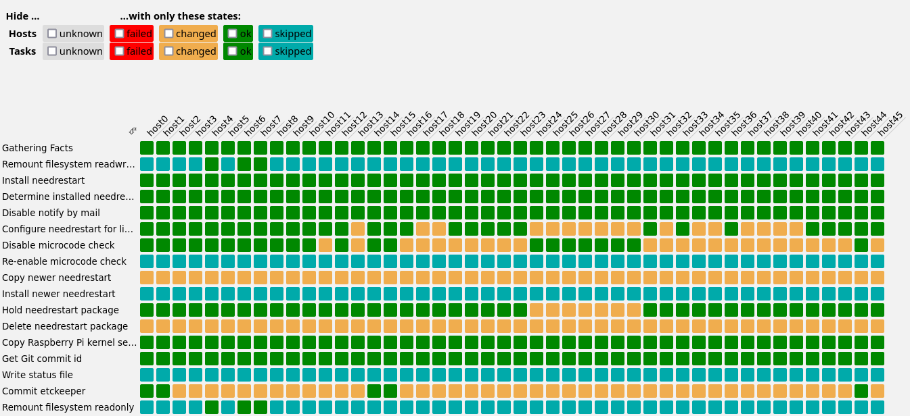

# Tabular view of AWX Job results

View the results of a job from AWX in a tabular way to get an overview of dozens
of tasks on dozens of hosts.

## How to install

You have to host the `index.html` file somewhere under the same host like your
AWX in order for the API authorization to work.

Since you are probably using Kubernetes to host AWX, one way to achieve this is
to to apply the provided `matrix-nginx.yml` (with a proper replacement for
`awx.example.com`) and copying the index.html into the persistent volume
afterwards.

## How to use

Open the page as `https://awx.example.com/matrix/#1234` where 1234 is the ID of
the job you want to view. When you change the ID afterwards, you have to reload
the page.

Loading the data from the API can take quite some time for large jobs and takes
place in chunks of 200 events at a time (which is the limit of the AWX API).
Very roughly, there are "# of hosts × # of tasks" many events to load.

Rendering happens up to 100 times during the loading process (and once
afterwards).

You can transpose the table (swap columns and rows) by clicking on the top left
cell.

You can filter rows and columns by selecting uninteresting states at the top.

